# RedMango

RedMango is a full-stack web solution designed to power a restaurant website. Built with ASP.NET Core for the backend API and React for the frontend web client, RedMango provides a robust, scalable platform for managing restaurant operations and enhancing the online dining experience.

## Features

- **Dynamic Menu Management:** Easily update and display the restaurant’s menu items.
- **Online Ordering:** Seamlessly place and manage customer orders.
- **Responsive Design:** Optimized for desktops, tablets, and mobile devices.
- **User Authentication:** Secure login and registration for customers and administrators.
- **Real-time Updates:** Leverage modern web technologies for smooth user interactions.
- **Scalability:** Designed to support growing traffic and additional features as needed.

## Technologies

- **Backend:** ASP.NET Core, C#, Entity Framework Core
- **Frontend:** React, TypeScript, HTML, CSS
- **Database:** SQL Server on Azure
- **Tools:** Visual Studio, Cursor, Git, GitHub
- **Cloud:** Integration with Azure

## Usage

- **Browse the Menu:** Explore various categories and dynamic content updates.
- **Place Orders:** Seamlessly place and manage orders online.
- **User Management:** Register or log in to view and manage your order history.
- **Admin Dashboard:** Use administrative tools to update menu items and manage orders.

## Demo & API

- **Live Demo:** Check out the [RedMango Demo](https://redmango12.azurewebsites.net/) to experience the restaurant website in action.
- **API Repository:** Explore the backend API code in the [RedMango API Repository](https://github.com/IlyaM70/RedMango_API).

### 🏠 Home Pages
| Home | Home (Alt) |
|------|------------|
| 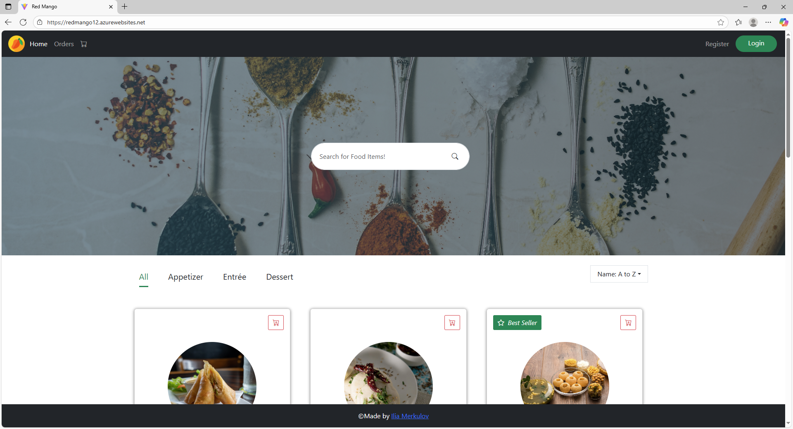 | 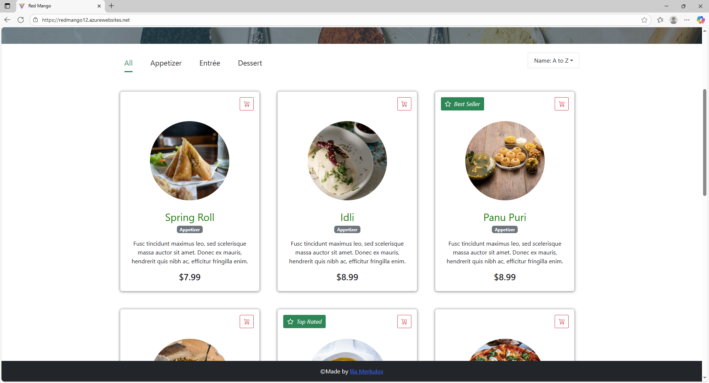 |

---

### 🔐 Authentication
| Login | Register |
|-------|----------|
| 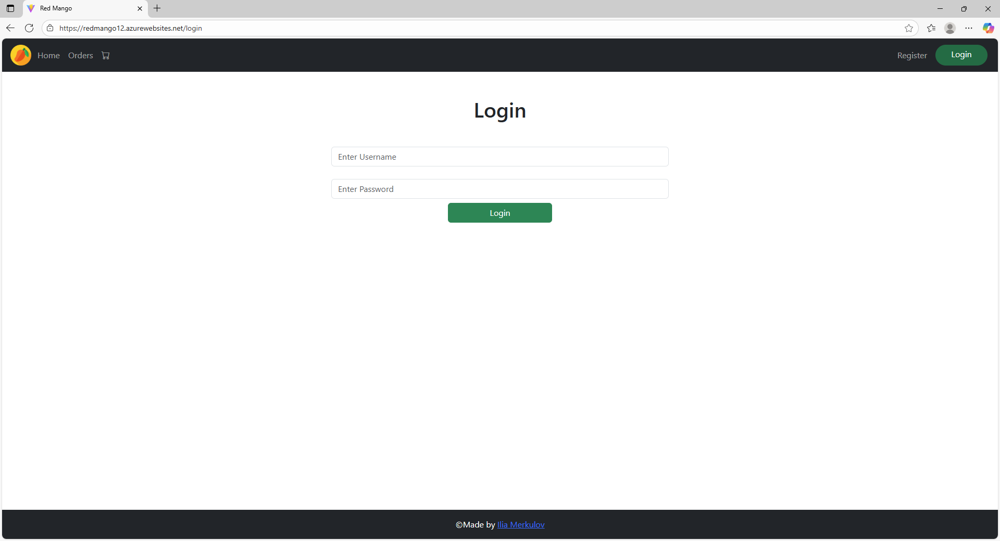 | 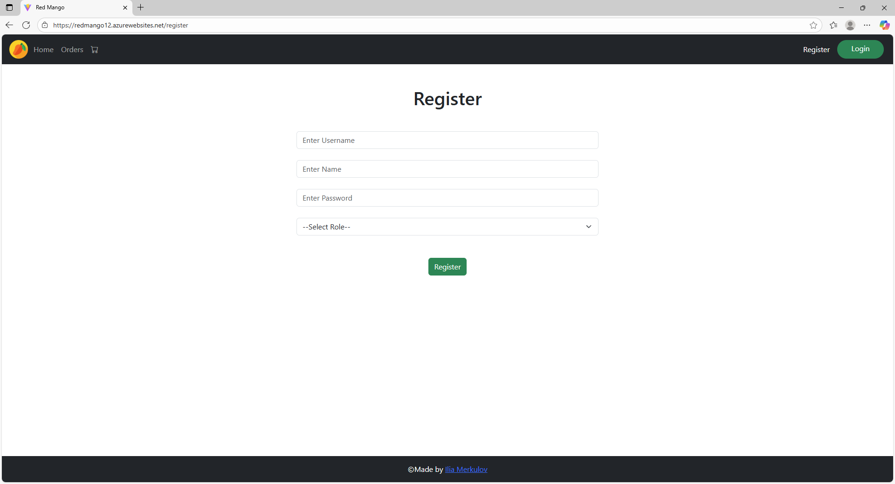 |

---

### 🛒 Shopping Flow
| Menu Item | Cart | My Orders |
|-----------|------|-----------|
| 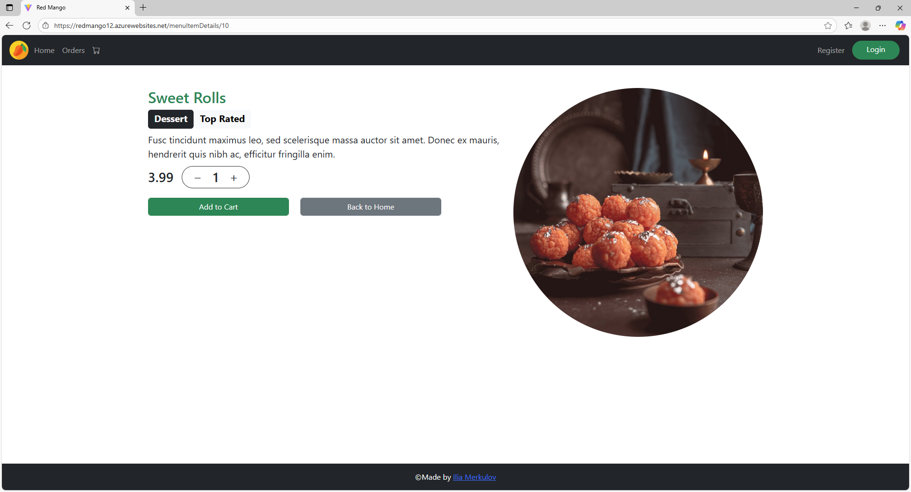 | 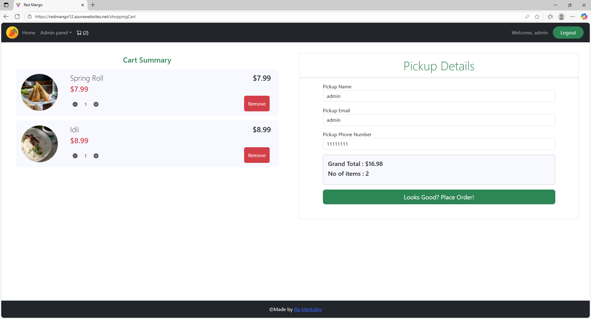 | 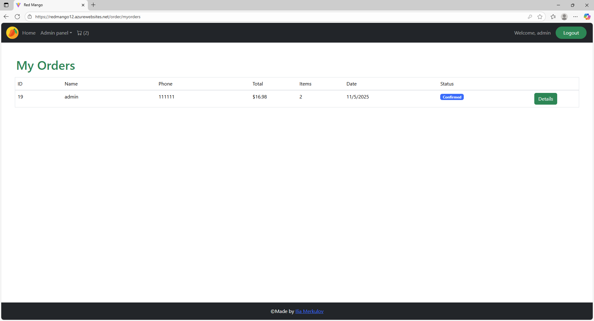 |

| Order Summary | Payment | Order Confirmed |
|---------------|---------|------------------|
| 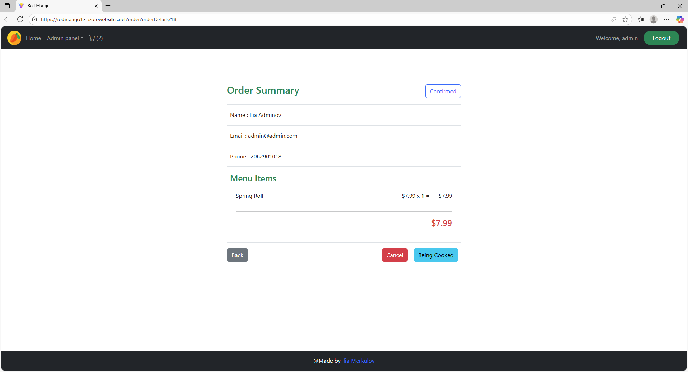 | 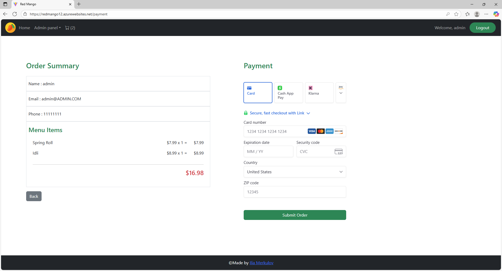 | 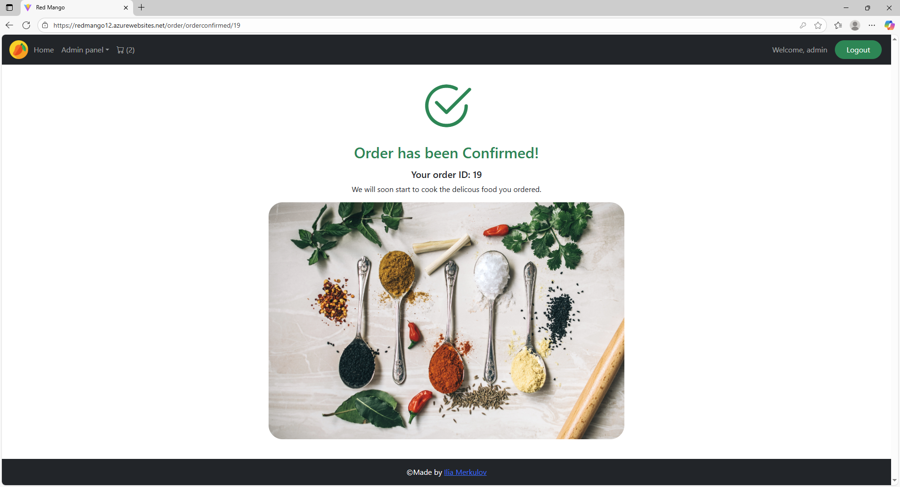 |

---

### 🛠️ Admin Panel
| Admin Panel - 1 | Admin Panel - 2 |
|------------------|------------------|
| 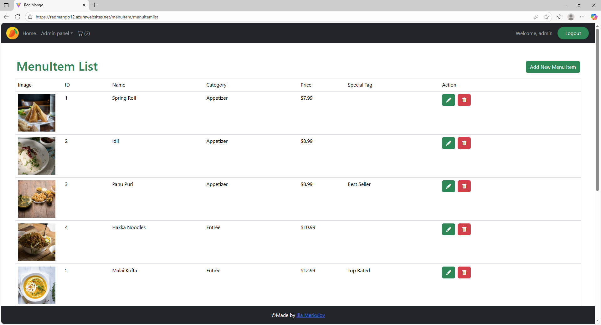 | 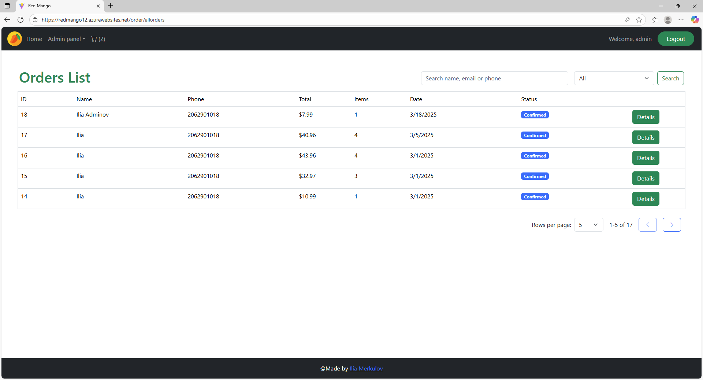 |

---
